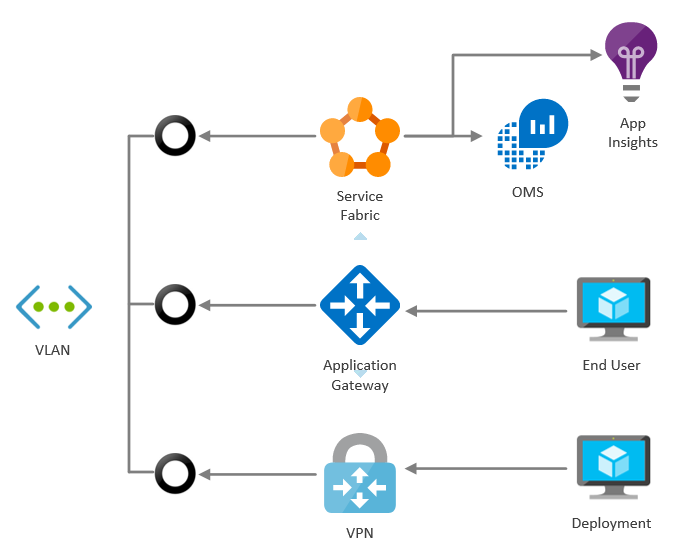

# Service Fabric Experimental templates

These templates can be used for automated deployment of Service Fabric Cluster.
Templates can be easily deployed by Visual Studio.
Templates doesn't solve security requirements for SF cluster (certificates for accessing cluster and certificates for inter-node communication.

### SFCluster

Standard SF cluster with external load balancer and public IP address, template exposes 3 application ports from SF cluster.

### SFClusterVMSSMonitoring

Standard SF cluster with external load balancer and public IP address, template exposes 3 application ports from SF cluster.
Traditionally template creates Application Insight and OMS workspace, all nodes are connected to OMS workspace. Application Insights and OMS is used for SF Cluster monitoring.
 
### SFClusterVMSSMonitoringAppGW

Standard SF cluster with internal load balancer, application gateway which exposes public IP address and traffic to applications (template exposes 3 application ports from SF cluster).
Traditionally template creates Application Insight and OMS workspace, all nodes are connected to OMS workspace. Application Insights and OMS is used for SF Cluster monitoring.
For SF cluster management and deployment is used VPN Gateway in Point To Site mode.

Before publish template:
* prepare ROOT and Client certificates for Point To Site VPN
    * https://docs.microsoft.com/en-us/azure/vpn-gateway/vpn-gateway-certificates-point-to-site
    * https://docs.microsoft.com/en-us/azure/vpn-gateway/vpn-gateway-certificates-point-to-site#clientcert
* Export public part of ROOT key to CER file and use it in template parameters
* Setup VPN client on client machine
    * https://docs.microsoft.com/en-us/azure/vpn-gateway/vpn-gateway-howto-point-to-site-resource-manager-portal  
 

