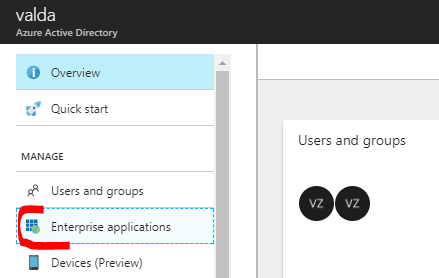
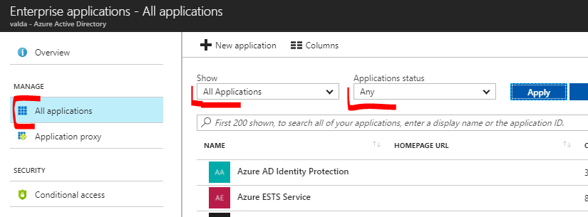
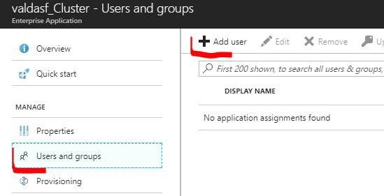

# Service Fabric Experimental templates

These templates can be used for automated deployment of Service Fabric Cluster.
Templates can be easily deployed by Visual Studio.
Templates doesn't solve security requirements for SF cluster (certificates for accessing cluster and certificates for inter-node communication.

### SFCluster

Standard SF cluster with external load balancer and public IP address, template exposes 3 application ports from SF cluster.

### SFClusterVMSSMonitoring

Standard SF cluster with external load balancer and public IP address, template exposes 3 application ports from SF cluster.
Traditionally template creates Application Insight and OMS workspace, all nodes are connected to OMS workspace. Application Insights and OMS is used for SF Cluster monitoring.
 
### SFClusterVMSSMonitoringAppGW

Standard SF cluster with internal load balancer, application gateway which exposes public IP address and traffic to applications (template exposes 3 application ports from SF cluster). 

Service Fabric cluster is provisioned with enabled addon "RepairManager" which provide to cluster automation OS updates. See: https://docs.microsoft.com/en-us/azure/service-fabric/service-fabric-patch-orchestration-application 

Traditionally template creates Application Insight and OMS workspace, all nodes are connected to OMS workspace. Application Insights and OMS is used for SF Cluster monitoring.
For SF cluster management and deployment is used VPN Gateway in Point To Site mode.

Before publish template (steps needed for Point To Site VPN):
* prepare ROOT and Client certificates for Point To Site VPN
    * https://docs.microsoft.com/en-us/azure/vpn-gateway/vpn-gateway-certificates-point-to-site
    * https://docs.microsoft.com/en-us/azure/vpn-gateway/vpn-gateway-certificates-point-to-site#clientcert
* Export public part of ROOT key to CER file and use it in template parameters
* Setup VPN client on client machine
    * https://docs.microsoft.com/en-us/azure/vpn-gateway/vpn-gateway-howto-point-to-site-resource-manager-portal  
 

### SFClusterVMSSMonitoringAppGWSecured

Secured SF cluster with internal load balancer, application gateway which exposes public IP address and traffic to applications (template exposes 3 application ports from SF cluster). 

**Cluster is secured by generated certificates and AD, please follow steps in this article (generate keys, KeyVault and Active Directory app)** : 
https://docs.microsoft.com/en-us/azure/service-fabric/service-fabric-cluster-creation-via-arm
* user can login to cluster only if has access right to tenant and application itself 
* cluster is secured by certificates
* for encrypting of secrets we can use different certificates than used for cluster security itself

Service Fabric cluster is provisioned with enabled addon "RepairManager" which provide to cluster automation OS updates. See: https://docs.microsoft.com/en-us/azure/service-fabric/service-fabric-patch-orchestration-application 

Traditionally template creates Application Insight and OMS workspace, all nodes are connected to OMS workspace. Application Insights and OMS is used for SF Cluster monitoring.
For SF cluster management and deployment is used VPN Gateway in Point To Site mode.

#### Before you will provision your cluster

##### Steps needed for SF cluster certificates and AD authorization
* get AAD Tenant ID for your Active Directory (In Azure portal select "Azure Active Directory", in selected AAD go to "Properties" -> there you can see "Direcotry ID" which is Tennat ID.
* edit script `deploy.ps1` and define your values in script header which reflects your environment - you can find there two sections with label `### DEFINE YOUR OWN VALUES THERE
* run script `deploy.ps1` (don't forget to change your working directory to the directory with deploy.ps1 script (it means to directory `SFClusterVMSSMonitoringAppGWSECURED`.
* finally you have to grant access to AAD users for Service Fabric Cluster
 * In Azure portal go to your active directory    
 * Select there "Enterprise application option in list of actions
 * 
 * Than go to list of all applications and change filter to "All Applications" and "Any" and hit button Apply
 * 
 * From the application list select you Service Fabric cluster application - there is something like `<YOUR_SF_CLUSTER_NAME>_Cluster`
 * There you can use option "Users and Groups" to grant access to users or groups from your AAD (grant  user access to "Admin" role.
 * 

##### Steps needed for Point To Site VPN:
* prepare ROOT and Client certificates for Point To Site VPN
    * https://docs.microsoft.com/en-us/azure/vpn-gateway/vpn-gateway-certificates-point-to-site
    * https://docs.microsoft.com/en-us/azure/vpn-gateway/vpn-gateway-certificates-point-to-site#clientcert
* Export public part of ROOT key to CER file and use it in template parameters
* Setup VPN client on client machine
    * https://docs.microsoft.com/en-us/azure/vpn-gateway/vpn-gateway-howto-point-to-site-resource-manager-portal  
 
##### Future reading and credits to

This repository (security part is inspired by **JJ's** github for secure Service Fabric cluster: https://github.com/jjindrich/jjazure-servicefabric . Also there you can find future reading about **encrypted properties/variables for development and production Service Fabric cluster** and how to handle these security assets.

